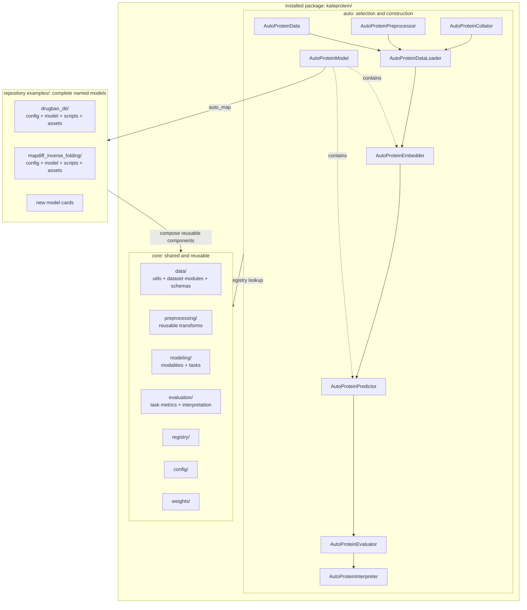
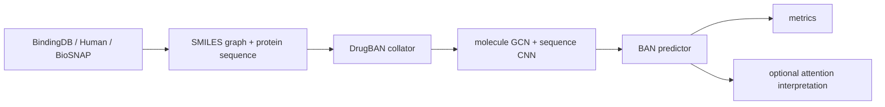
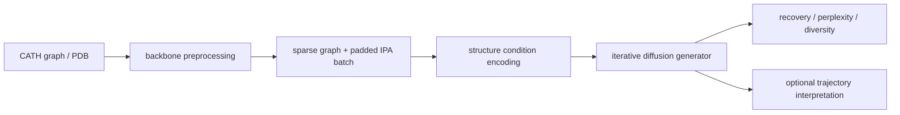

# KaleProtein Architecture

The repository has three layers: generic Auto dispatch, reusable core
components, and complete model examples. Only the `kaleprotein/` library package
is installed; `examples/`, `tests/`, and `docs/` remain repository-level
resources.

```text
kaleprotein/
  auto/
  core/
examples/
tests/
docs/
```



## User API

Users normally construct one data composition and one complete model from the
same model card:

```python
config = AutoProteinConfig.from_pretrained("DTI/DrugBAN")
loader = AutoProteinDataLoader(
    "BindingDB/DTI",
    config=config,
    root="path/to/datasets",
    batch_size=64,
)
model = AutoProteinModel.from_config(config, pretrain=True)
```

`AutoProteinModel` reads the model card and imports its `modeling.py`. It does
not contain a DrugBAN or MapDiff condition. `AutoProteinDataLoader` uses the
data id only for normalized records and the config only for preprocessing and
collation. It never creates or retains the model.

## Model Composition

The concrete class is the composition root. DrugBAN declares:

```text
DrugBANModel
  protein_embedder  <- AutoProteinEmbedder("sequence/cnn")
  molecule_embedder <- AutoProteinEmbedder("molecule/gcn")
  predictor         <- AutoProteinPredictor("dti/ban")
```

MapDiff declares:

```text
MapDiffModel
  embedder  <- AutoProteinEmbedder("structure/mapdiff_condition")
  predictor <- AutoProteinPredictor("inverse_folding/mapdiff_generator")
```

For a discriminative model, the predictor is the task fusion/head. For a
generative model, the predictor is the generator or denoiser. Component Auto
classes are model-author APIs; they do not resolve full model cards.

## Named Stage Contracts

Public pipeline boundaries exchange ordinary dictionaries. Each next stage
expands that dictionary into named arguments:

```python
inputs = next(iter(loader))
embeddings = model.embed(**inputs)
prediction = model.predictor(**embeddings)
metrics = model.evaluate(**prediction)
```

For generative models, the second call becomes
`model.predictor.generate(**embeddings)`. The loader-to-embedder and
embedder-to-predictor boundaries both remain explicit and replaceable.
`AutoProteinModel` groups and loads those model components; it does not collapse
the normal pipeline into `model(**inputs)`.

The high-level loader is equivalent to the following replaceable low-level
composition:

```python
dataset = AutoProteinData("BindingDB/DTI", root="path/to/datasets")
preprocessor = AutoProteinPreprocessor.from_config(config)
processed = preprocessor.process(dataset)
collator = AutoProteinCollator.from_config(config)
batch = collator(**processed)
```

`Dataset/Task` identifies reusable normalized data. The separate model config
is required because models sharing one task can need different featurization,
padding, and collation. The loader validates that the data task and model task
match.

Auto requires mappings at these boundaries, but it does not prescribe one
universal tensor schema. The concrete model card owns meaningful names. For
example, DrugBAN uses `protein_embedding` and `molecule_embedding`, while
MapDiff uses `structure_embedding`, `conditioning`, and `batch`. Predictors and
generators declare the fields they consume and accept unrelated metadata with
`**kwargs` when it should flow to a later stage. This lets users replace or
insert components using normal Python APIs instead of adapting positional
tuples or framework-specific workflow containers.

Concrete model classes never create datasets, preprocessors, collators, or
data loaders. They receive already-collated tensor mappings. The Auto data
composition owns batching; executable scripts own iteration, device transfer,
optimization, and other workflow orchestration.

## Runtime Pipelines

DrugBAN:



MapDiff:



## Ownership Rules

- `auto/` owns generic dispatch and composition only. `AutoProteinDataLoader`
  composes registered data components without importing a concrete model.
- `core/data/utils/` owns fundamental FASTA, tabular, PDB, mmCIF, and file
  parsing functions.
- `core/data/<dataset>.py` owns built-in dataset adapters such as BindingDB,
  BioSNAP, Human, and CATH. Public ids use `Dataset/Task` order.
- `core/data/datasets.py` and `core/data/records.py` own shared dataset classes and
  stable data records.
- `core/preprocessing/` owns reusable transformations that prepare records for
  model inputs without becoming dataset loaders.
- `core/modeling/modalities/` owns reusable modality encoders and neural layers.
- `core/modeling/tasks/` owns reusable fusion layers, heads, predictors, and
  generators.
- `core/evaluation/tasks/` owns task metrics and interpretation methods.
- `examples/<model>/` owns concrete model composition, model-specific layers,
  collators, feature graphs, forward/generate behavior, scripts, and checkpoint
  state adapters. Collators remain separate from model classes.
- `AutoProteinModel` owns full-model checkpoint resolution, optional download,
  and the single call into the concrete model's `load_checkpoint()` adapter.
  Nested components never resolve or download that checkpoint again.

Adding a new model normally adds one example directory and model card. Core is
changed only when the model introduces a genuinely reusable component; Auto is
not changed.

In a source checkout, `kaleprotein` discovers cards from the adjacent
`examples/` directory. Installed wheels do not include those examples; users or
downstream packages register external model cards through
`discover_model_cards(...)` or `register_model_card(...)`.
