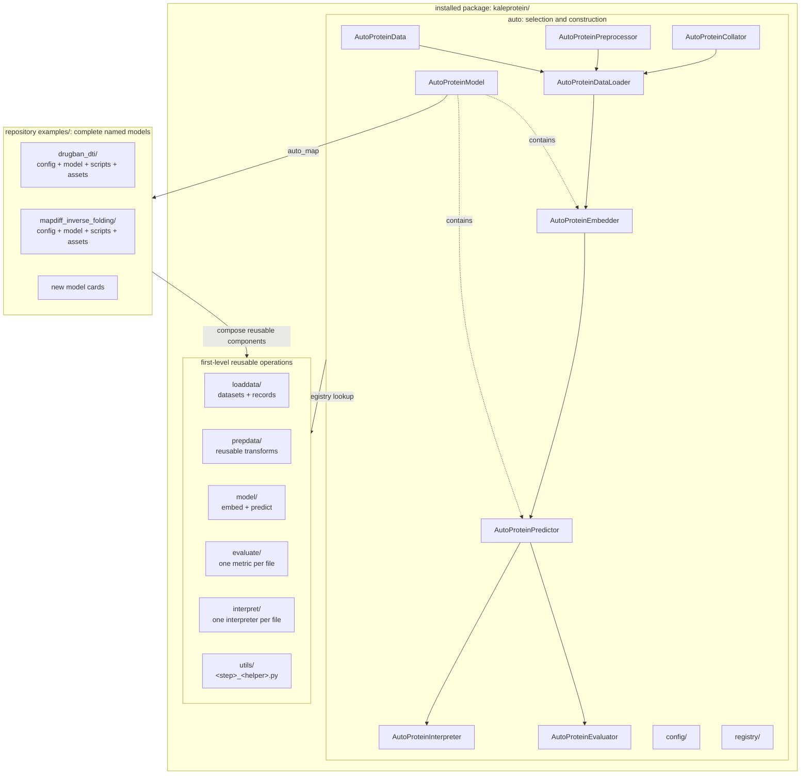
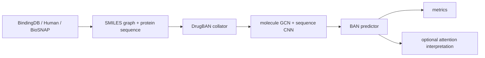
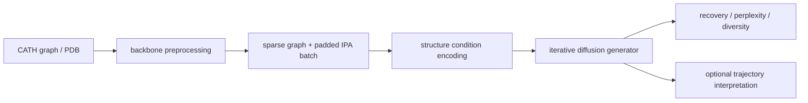

# KaleProtein Architecture

The repository has three conceptual layers: generic Auto dispatch, reusable
first-level operation packages, and complete model examples. Only the
`kaleprotein/` library package is installed; `examples/`, `tests/`, and `docs/`
remain repository-level resources.

```text
kaleprotein/
  auto/
    config/
    registry/
  loaddata/
  prepdata/
  model/
    embed/
    predict/
  evaluate/
  interpret/
  utils/
examples/
tests/
docs/
```



## User API

Users normally construct one data composition and one complete model from the
same model card:

```python
from kaleprotein.auto import (
    AutoProteinConfig,
    AutoProteinDataLoader,
    AutoProteinModel,
)
from examples.drugban_dti import register_model_card

register_model_card()
config = AutoProteinConfig.from_pretrained("DTI/DrugBAN")
loader = AutoProteinDataLoader(
    "BindingDB/DTI",
    config=config,
    root="path/to/datasets",
    batch_size=64,
)
model = AutoProteinModel.from_config(config, pretrain=True)
```

`AutoProteinModel` reads the model card and imports its `model_<name>.py`. It does
not contain a DrugBAN or MapDiff condition. `AutoProteinDataLoader` uses the
data id only for normalized records and the config only for preprocessing and
collation. It never creates or retains the model.

## Model Composition

The concrete class is the composition root. DrugBAN declares:

```text
DrugBANModel
  protein_embedder  <- AutoProteinEmbedder("sequence/cnn")
  molecule_embedder <- AutoProteinEmbedder("molecule/gcn")
  predictor         <- AutoProteinPredictor("dti/ban")
```

MapDiff declares:

```text
MapDiffModel
  embedder  <- AutoProteinEmbedder("structure/mapdiff_condition")
  predictor <- AutoProteinPredictor("inverse_folding/mapdiff_generator")
```

For a discriminative model, the predictor is the task fusion/head. For a
generative model, the predictor is the generator or denoiser. Component Auto
classes are model-author APIs; they do not resolve full model cards.

Reusable component ids map directly to flat module names:

```text
AutoProteinEmbedder("molecule/gcn") -> model/embed/molecule_gcn.py
AutoProteinEmbedder("sequence/cnn") -> model/embed/sequence_cnn.py
AutoProteinPredictor("dti/ban")     -> model/predict/dti_ban.py
```

The `{namespace}/{component}` id becomes
`{namespace}_{component}.py`. Model-specific components may instead register
when the example's `model_<name>.py` is imported.

## Named Stage Contracts

Public pipeline boundaries exchange ordinary dictionaries. Each next stage
expands that dictionary into named arguments:

```python
inputs = next(iter(loader))
embeddings = model.embed(**inputs)
prediction = model.predict(**embeddings)
metrics = model.evaluate(**prediction)
interpretation = AutoProteinInterpreter.from_config(config).explain(**prediction)
```

For generative models, the second call becomes
`model.generate(**embeddings)`. The loader-to-embedder and
embedder-to-predictor boundaries both remain explicit and replaceable.
`AutoProteinModel` groups and loads those model components; it does not collapse
the normal pipeline into `model(**inputs)`.

Evaluation and interpretation are independent consumers of the same output
mapping. Evaluation aggregates quantitative metrics against labels or reference
sequences. Interpretation transforms model evidence such as attention maps or
denoising trajectories into sample-level explanations; neither stage invokes
the other.

The high-level loader is equivalent to the following replaceable low-level
composition:

```python
dataset = AutoProteinData("BindingDB/DTI", root="path/to/datasets")
preprocessor = AutoProteinPreprocessor.from_config(config)
processed = preprocessor.process(dataset)
collator = AutoProteinCollator.from_config(config)
batch = collator(**processed)
```

`Dataset/Task` identifies reusable normalized data. The separate model config
is required because models sharing one task can need different featurization,
padding, and collation. The loader validates that the data task and model task
match.

Auto requires mappings at these boundaries, but it does not prescribe one
universal tensor schema. The concrete model card owns meaningful names. For
example, DrugBAN uses `protein_embedding` and `molecule_embedding`, while
MapDiff uses `structure_embedding`, `conditioning`, and `batch`. Predictors and
generators declare the fields they consume and accept unrelated metadata with
`**kwargs` when it should flow to a later stage. This lets users replace or
insert components using normal Python APIs instead of adapting positional
tuples or framework-specific workflow containers.

Concrete model classes never create datasets, preprocessors, collators, or
data loaders. They receive already-collated tensor mappings. The Auto data
composition owns batching; executable scripts own iteration, device transfer,
optimization, and other workflow orchestration.

## Runtime Pipelines

DrugBAN:



MapDiff:



## Ownership Rules

- `auto/` owns generic dispatch, configuration, registration, and composition.
  Its public modules mirror the operation verbs: `loaddata.py`, `prepdata.py`,
  `model.py`, `evaluate.py`, and `interpret.py`. Dataset selection, collator
  selection, and batch loading share `loaddata.py` because they form one data
  pipeline.
- `utils/<step>_<helper_function>.py` owns stateless cross-component helpers.
  The step prefix is one of `loaddata`, `prepdata`, `model`, `evaluate`, or
  `interpret`; examples include `loaddata_parse_pdb.py`,
  `model_move_to_device.py`, and `evaluate_extract_sequences.py`.
- `loaddata/<dataset>.py` owns built-in adapters such as BindingDB, BioSNAP,
  Human, and CATH. Public ids use `Dataset/Task` order.
- `loaddata/base_dataset.py` and `loaddata/records.py` own shared dataset classes
  and stable records.
- `prepdata/` owns reusable transformations that prepare records for model
  inputs without becoming dataset loaders.
- `model/embed/` owns reusable modality and condition encoders.
- `model/predict/` owns reusable fusion layers, heads, predictors, and
  generators.
- `evaluate/<metric>.py` owns one reusable quantitative metric and registers
  the task/metric pairs it supports.
- `interpret/<method>.py` owns one reusable interpretation method and registers
  the task/method pairs it supports.
- `auto/model.py` owns pretrained path resolution, downloading, checksum policy,
  and missing-weight errors.
- `utils/model_load_checkpoint_state_dict.py` owns model-independent checkpoint
  loading and state-dict extraction used by concrete model adapters.
- `examples/<model>/` owns concrete model composition, model-specific layers,
  collators, feature graphs, forward/generate behavior, scripts, and checkpoint
  state adapters. Collators remain separate from model classes.
- `AutoProteinModel` owns full-model checkpoint resolution, optional download,
  and the single call into the concrete model's `load_checkpoint()` adapter.
  Nested components never resolve or download that checkpoint again.

Adding a new model normally adds one example directory and model card. A
first-level reusable package changes only when the model introduces a genuinely
reusable operation; Auto is not changed.

`import kaleprotein` only reads package metadata. It does not initialize
registries or inspect the repository. Built-in datasets and preprocessors
register lazily when their Auto API is used. Model cards remain explicit:
repository examples register their own card before a workflow starts, while
users and downstream packages call `discover_model_cards(...)` or
`register_model_card(...)`.
