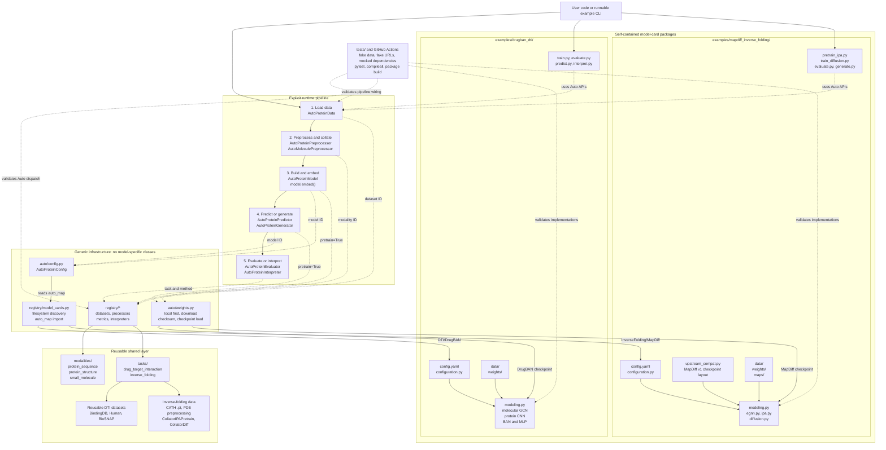

# KaleProtein Architecture

KaleProtein uses a model-card-driven Auto layer. Shared Auto classes discover
implementations from `config.yaml` and `auto_map`; architecture-specific code
stays inside each model package.

## Ownership Boundaries

- `auto/` resolves public identifiers and checkpoints but does not define
  DrugBAN, MapDiff, or another concrete architecture.
- `registry/`, `modalities/`, and `tasks/` contain reusable discovery,
  preprocessing, dataset, metric, and interpretation components.
- `examples/<model>/` owns the model card, configuration class, model classes,
  workflow scripts, maps, and weight location for that architecture.
- Every workflow exposes the same stages while retaining model-specific train,
  evaluation, prediction, interpretation, or generation behavior.
